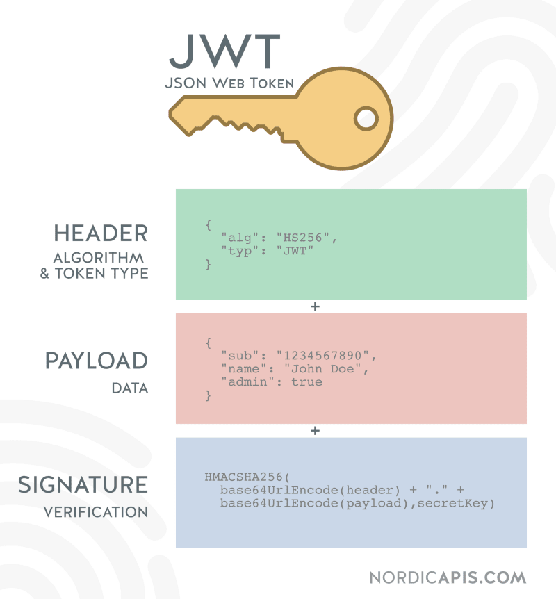

# Spring Blog REST-API

This is simple web-blog with [jwt authentication](https://jwt.io/introduction/)

* [JWT](#JWT)
* [Used technologies](#used-technologies)

## JWT
JSON Web Token (JWT) is an open standard (RFC 7519) that defines a compact and self-contained way for securely transmitting information between parties as a JSON object. This information can be verified and trusted because it is digitally signed.

 
 
#### Authentication

## Used technologies

* [Maven](https://maven.apache.org/) to buid project
* [Java](https://www.oracle.com/ru/java/technologies/) language
* [Lombok](https://projectlombok.org/) annotations
* [PostgreSQL](https://www.postgresql.org/) database
* [Apache Commons IO](https://commons.apache.org/proper/commons-io/) to work with io
* [Swagger](https://swagger.io/) to document API
* [FreeMarker](https://freemarker.apache.org/) to create html page for sending to email
* [Spring mail](https://docs.spring.io/spring-framework/docs/3.0.x/spring-framework-reference/html/mail.html) to sending emails
* [jjwt](https://github.com/jwtk/jjwt) for security
